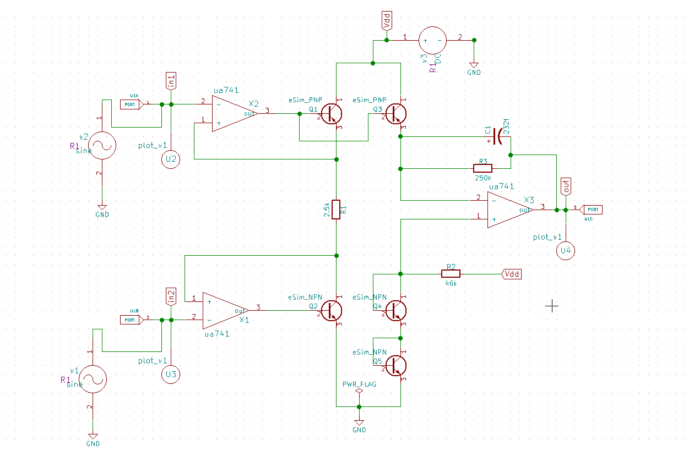
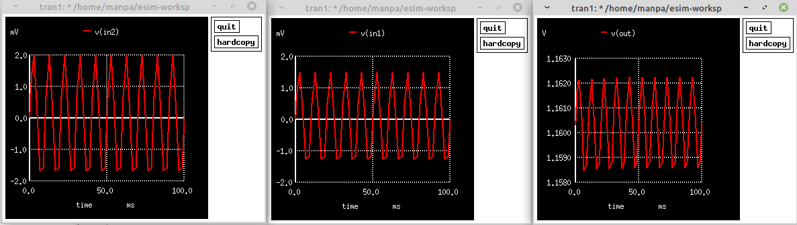

# eSim Hackathon - FOSSEE IIT Bombay

My submission for the e-Sim: Circuit Design and Simulation Marathon, organized by IIT Bombay and VLSI System Design Corp.Pvt. Ltd.

## Submission Details

**Circuit Name**: Optimized Instrumentation Amplifier for Biomedical Applications 

**Software**: eSim ([Download here](https://esim.fossee.in/downloads))

**OS**: Linux Mint x86_64 kernel 5.4.0

## Hackathon Proccedings:

-  ***Literature Survey*** : The domain chosen was Analog Signal Processing. The literature survey was initiated by revising the basic concepts from "Op-Amps and Linear Integrated Circuits" by R.A Gayakwad. This was followed by searching the recent conference/journal papers on Amplifiers. After reading around 8 papers, around 2 papers were finalized to work on. The two papers were mostly focussed on implementing an Instrumentation Amplifiers for processing very small biomedical signals like ECG, EEG etc.For this hackathon the amplifier design implementation was the chosen idea to proceed with. The design analysis and op amp circuit is beyond the scope of this hackathon which I plan to work on in a long run.
     - References chosen: 
        1. A low offset instrumentation amplifier for bio­medical applications ([link](https://ieeexplore.ieee.org/document/8394168/authors#authors))
        2. A novel high CMRR trans-impedance instrumentation amplifier for biomedical applications ([link](https://link.springer.com/article/10.1007/s10470-018-1256-8))

-  ***Getting Started with eSim***: Learning the software was one of the most integral part of the hackathon. The [spoken tutorials](https://spoken-tutorial.org/tutorial-search/?search_foss=eSim&search_language=English) was a good start to get used to the interface. The [udemy course](https://www.udemy.com/course/vsd-intern-10-bit-dac-design-using-esim-and-sky130/) for a 10-bit DAC provided my the organisers and the [eSim 2020 user manual](https://static.fossee.in/esim/manuals/eSim_Manual_2020_August.pdf) was used as a reference to understand eSim and Sky130.

-  ***Circuit Design and Simulation in eSim***:
    
    - a. The circuit required opamp which was not present in sky130 (*presently*). Hence, firstly an opamp subcircuit schemetic was created (*ua741*), followed by generating a netlist for the same. Then the kikad schemetic was converted into ngspice.

    - b. A component of the subcircuit was created in the *Library Editor* to be used in my main circuit.

    - c. A new project is then created which uses the new opamp as a *component*. After adding all the components  sinosoidal inputs were provided (*since biomedical signals cannot be mimicked*) and plots were placed at the inputs and the outputs to visualize it in the simulation. This process is followed by annotating the circuit,doing electrical checks and generating netlist for the circuit.

    - d. The kikad to ngspice conversion is initiated. The .lib files and the subcircuit files from the "~/eSim-2.1/library/deviceModelLibrary/Transistor/PNP.lib" and "~/eSim-2.1/library/SubcircuitLibrary/ua741" was provided and added it under the DeviceModelling and Subcircuits tab. The input signal parameters are also provided here for the conversion to occur.
    (*In the repository I have provided the .lib and subcircuit files externally in the DeviceModelLibrary and Subcircuits directory*))

    - e. A simulation of the input and the outputs waveforms are generated.The circuit very well amplifies the millivolts input signals to the range of Volts which is suitable for further processing.

- ***Circuit Specifications***

   The design process in biomedical sensing operations is dominated by the instrumentation amplifier design which determines the amplification of weak signals without adding any significant amount of noise. 
   
   ***Circuit:***

   

    The circuit uses a current feedback based Instrumentation amplifier (IA). In my e-Sim implementation transistors are used in the outputs of the op-amps of the first stage IA to decrease the current loading from the op-amps. The extracurrent is no longer the additional current but the current required by the resistor in the later stage. This design reducesthe input-referred offset largely. This arrangement of the opamp and a transistor in its output will act as a voltage to current converter and thus produce a current proportional tothe input voltage. In this process, the voltage swings which occur at the output of the first stage of the instrumentation amplifier drops down. To convert the current back to voltage after this stage, a mirror of MOSFET in the first stage is connected to the op-amp in the second stage of the IA and thus a trans-impedance amplifier is formed to get back the voltage from the current in the second stage. This stage acts as a voltage to current converter. A bias circuit is used to provide an appropriate common-mode voltage to the third op-amp. This design makes the output common-mode voltage of this circuit independent of the input common-mode voltage.
    
    The op-amp specifications are not optimized for this circuit but promise a high future scope in this area. The design is implemented in the eSim electronic design automation software which provides all the capabilities to implement this design.

   ***Waveforms***

    

